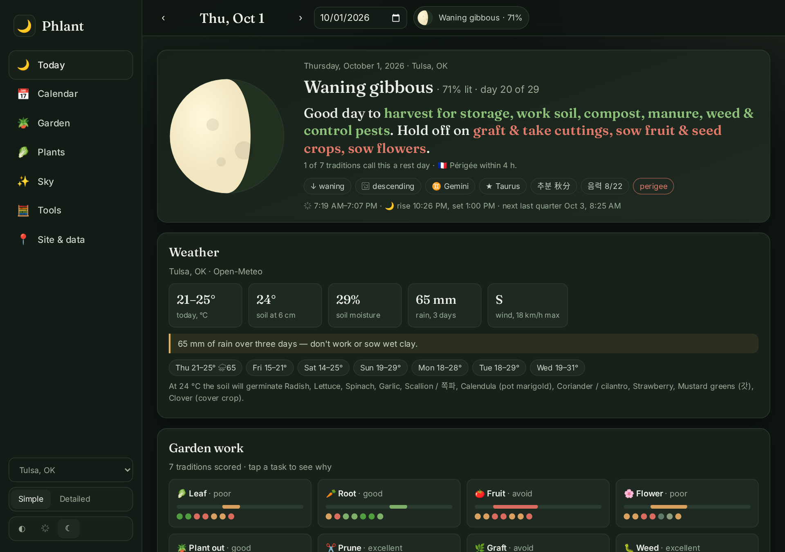
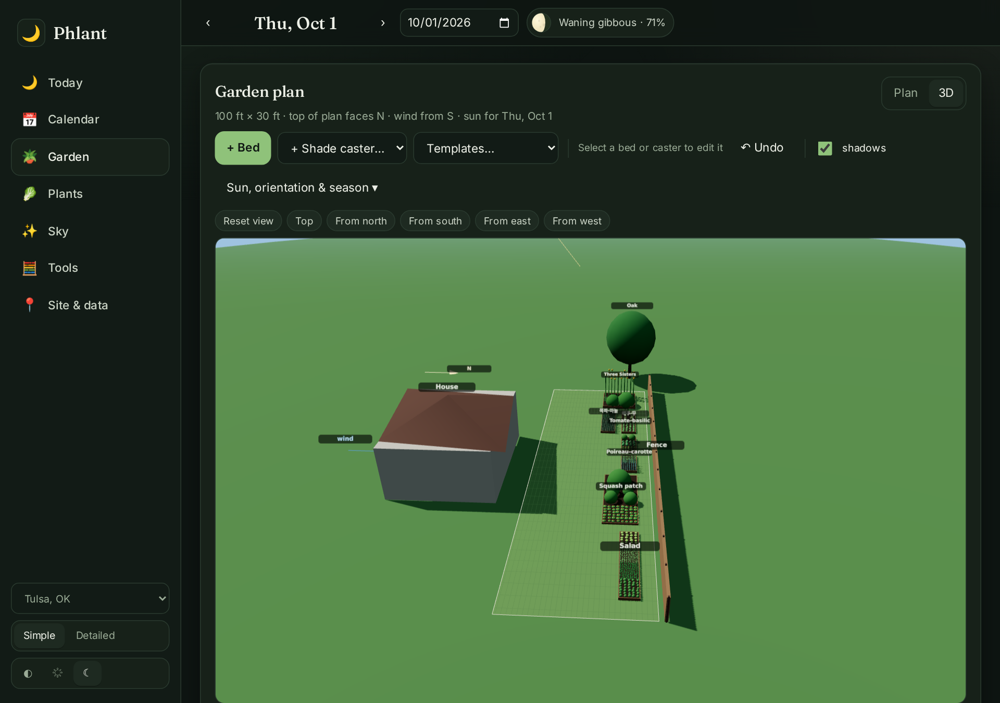
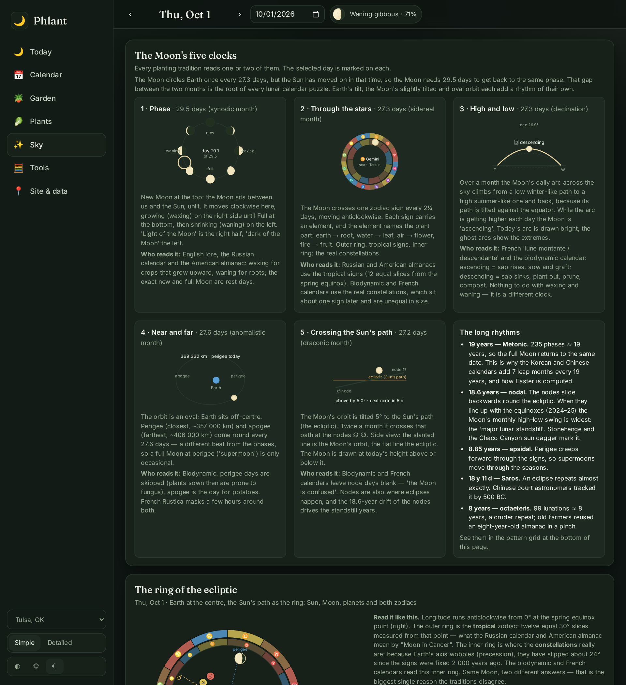
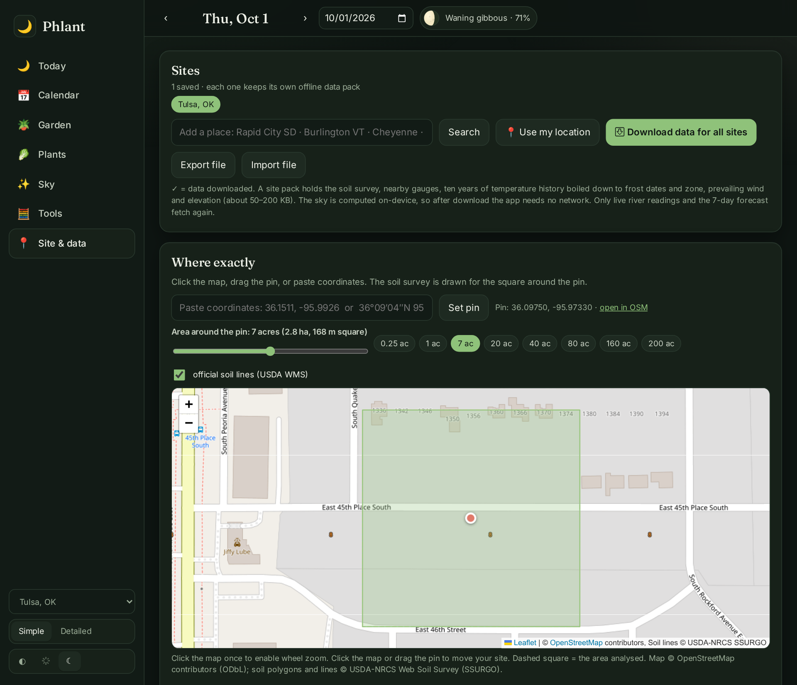
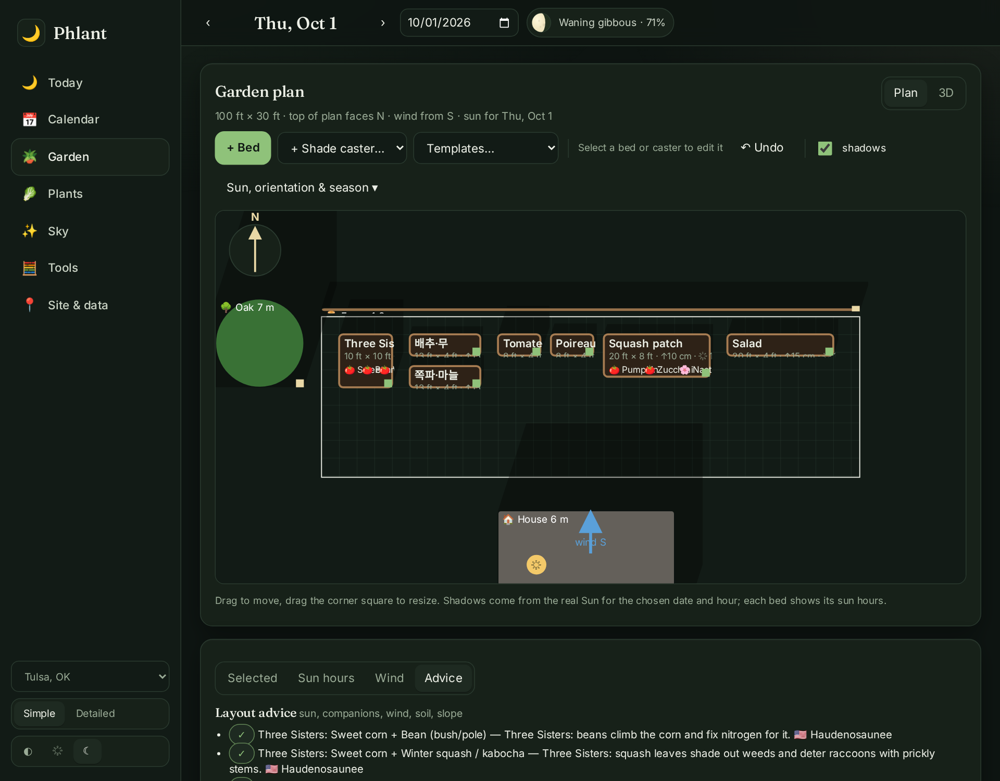
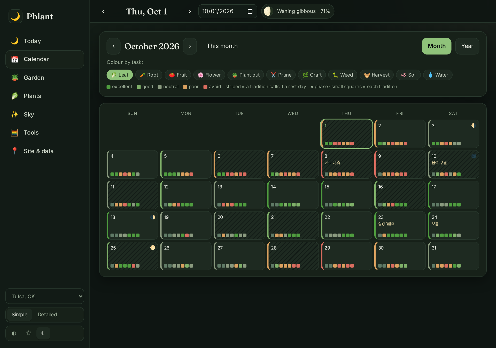
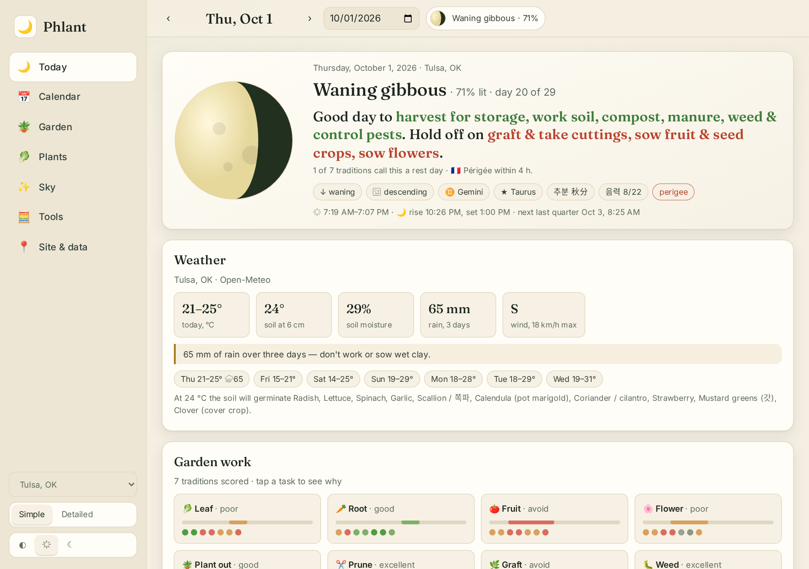

<p align="center">
  
</p>
<h1 align="center">Phlant</h1>
<p align="center"><b>Seven planting traditions, one sky, your soil.</b><br/>
A comparative moon-and-tradition planting almanac that computes everything from real ephemeris, for any place on Earth, and works offline.</p>

<p align="center">
  <a href="https://phlant.robbiemed.org">phlant.robbiemed.org</a> ·
  <a href="https://github.com/robbie-med/phlant/actions/workflows/ci.yml"></a>
  <a href="https://github.com/robbie-med/phlant/actions/workflows/pages.yml"></a>
  
  
</p>

<p align="center"></p>

## What it does

Most moon-gardening apps pick one tradition and print a lookup table. Phlant computes the sky for your coordinates and date, runs **seven traditions** over it as independent rule engines, and shows you where they agree and why they disagree:

| | Tradition | What it reads |
|---|---|---|
| 🇰🇷 | **Korean 농사력** | 24 절기 by exact solar longitude, 음력 (KST), 삼복, 한식, 손 없는 날, 농가월령가 |
| 🇨🇳 | **Chinese 农历 / 通书** — 华北, 江南, 岭南, 东北 variants | 节气 with regional 农谚, lunar date (CST), 干支 day → 建除十二神 day officers, 月忌日 |
| 🇩🇪 | **Biodynamic (Maria Thun)** | real sidereal constellations (IAU boundaries) → root/leaf/flower/fruit days, ascending/descending Moon, nodes, perigee, Moon ☍ Saturn |
| 🇫🇷 | **Jardiner avec la Lune (Rustica)** | lune montante/descendante, jours racines/feuilles/fleurs/fruits, nœuds, apogée/périgée, lune rousse, saints de glace |
| 🇬🇧 | **English cottage lore** | waxing/waning, change of the Moon, Tresillian peak, saints' days |
| 🇷🇺 | **Лунный посевной календарь** | tropical signs (fertile/barren), forbidden days, лунные сутки by moonrise, Orthodox folk calendar |
| 🇺🇸 | **Old Farmer's Almanac & the Signs** | Moon quarter (light/dark), tropical sign → body part, fruitful/barren, Northeast folk dates |

Nothing is a lookup table: the Moon's phase, both zodiacs, declination, distance, nodes, the solar terms, the lunisolar months and leap months, and the sexagenary day are all computed on-device with [astronomy-engine](https://github.com/cosinekitty/astronomy), and pinned by tests to known calendar facts.

### Your place, not a generic one

- **Site packs** — one download per location, then fully offline: ten years of temperature history → your frost dates and hardiness zone; three years of hourly wind → a wind rose by month; the **USDA soil survey** at your pin (SoilGrids elsewhere); nearby **USGS** stream and groundwater gauges; elevation. Several sites, export/import.
- **Soil map** — the official SSURGO polygons for 0.25–200 acres around the pin, with each unit's share, texture, drainage and capability class, on an OpenStreetMap base map (Leaflet).
- **Weather** — 7-day outlook with soil temperature and moisture, frost and rain warnings, and which in-window crops will germinate at today's soil temperature.

### The garden

- **2D plan** with beds, raised heights, plantings, and shadow casters (house, trees, fences, sheds, greenhouses). Set the plan's compass orientation. Scrub the hour and watch real shadows move; see **sun hours per bed** for any date, with who shades whom.
- **3D view** (three.js) lit by the actual Sun for the date and hour, with soft shadows, stylised crops at true height and spacing, the day's sun path, and north and wind arrows.
- Companion planting from seven traditions, windward advice from the month's dominant wind, templates (Three Sisters, Korean 김장 bed, French potager pairs), undo, import/export.

### Learn the sky

The Sky page explains the Moon's five clocks (phase, zodiac, height, distance, nodes) with live diagrams, draws the ring of the ecliptic with Sun, Moon and planets against both zodiacs, lists exact sign-change times, and shows twenty years of patterns at once so the 19-year Metonic repeat is visible.

<p align="center">
  
  
</p>
<p align="center">
  
  
</p>
<p align="center">
  
  
</p>

## Run it

```bash
npm install
npm run dev        # http://127.0.0.1:3917
npm test           # vitest — calendar anchors, lunisolar leap months, IAU boundaries, sun geometry
npm run build      # PWA in dist/
```

Node 18+ (18 needs the Web Crypto flag the build script already passes). Full details in [CONTRIBUTING.md](CONTRIBUTING.md).

**Android:** the build is Capacitor-ready — `npm run cap:init && npm run cap:android`, then open `android/` in Android Studio. See [docs/DEPLOY.md](docs/DEPLOY.md).

## Documentation

- [docs/ARCHITECTURE.md](docs/ARCHITECTURE.md) — how the ephemeris, traditions, garden geometry and offline packs fit together
- [docs/TRADITIONS.md](docs/TRADITIONS.md) — every tradition, what it reads, its sources, and a worked example (generated from the code)
- [docs/DATA-SOURCES.md](docs/DATA-SOURCES.md) — every external service, endpoint and licence
- [docs/DEPLOY.md](docs/DEPLOY.md) — GitHub Pages, self-hosting, APK
- [CHANGELOG.md](CHANGELOG.md)

## Privacy

No accounts, no backend, no analytics. Settings and site packs live in your browser. The only data sent anywhere are coordinates to the public services in `docs/DATA-SOURCES.md`.

## Contributing

Corrections to tradition rules are especially welcome — every rule cites a source, and there is an [issue template](.github/ISSUE_TEMPLATE/tradition.yml) for them. See [CONTRIBUTING.md](CONTRIBUTING.md) and the [code of conduct](CODE_OF_CONDUCT.md).

## Licence

MIT © robbie-med. Third-party data and libraries keep their own licences — see [THIRD-PARTY.md](THIRD-PARTY.md).
